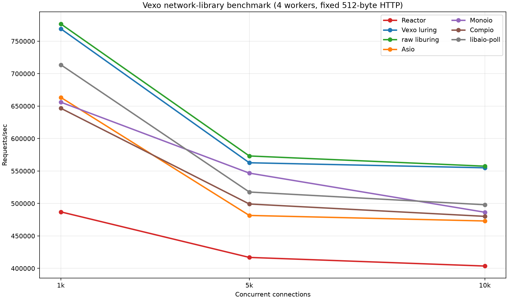
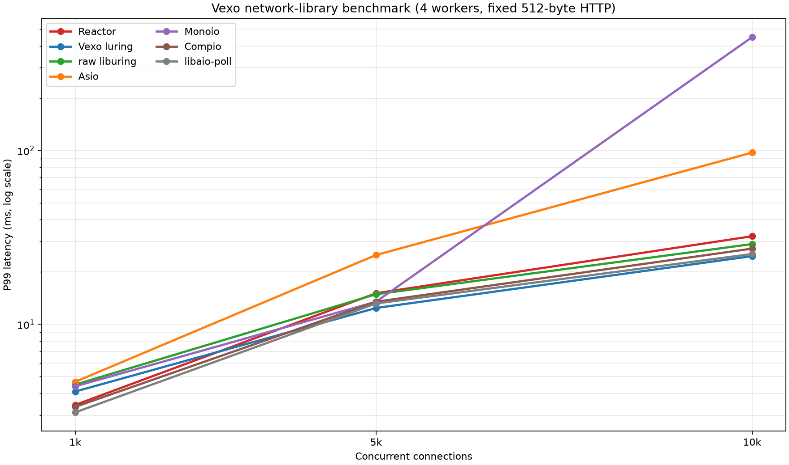
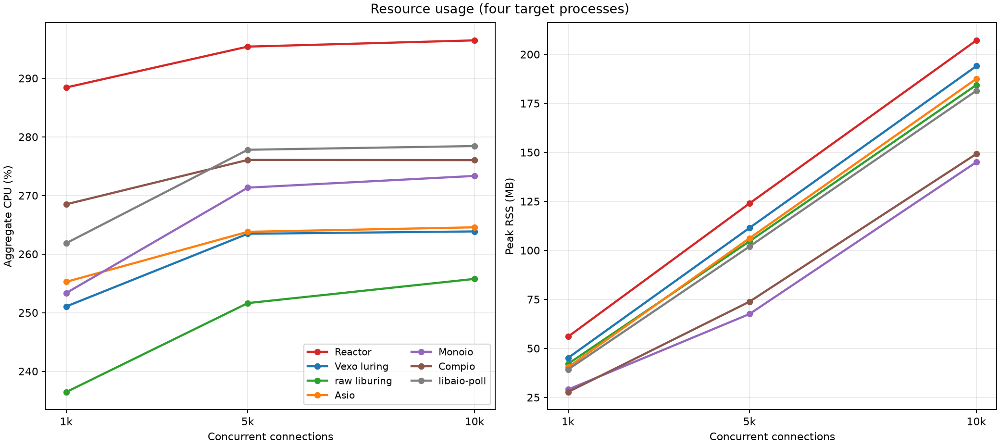

# 七个网络库统一公平压测：Reactor、Vexo luring 与外部库

本报告记录 Vexo Reactor、Vexo luring 与外部网络库在同一台机器、同一批次、同一套 `wrk` 参数下的固定 HTTP 网络压测。图表、汇总数据和每轮关键结果都保存在本文件中；原始进程日志和临时适配器源码不纳入仓库。

## 结论

清点后目标实际是 7 个：Reactor、Vexo luring、raw liburing、Asio、Monoio、Compio、libaio。七个目标全部在同一批次、同一台机器、同一套 wrk 参数下重测。

- 吞吐第一梯队是 raw liburing 与 Vexo luring；c=1000 raw liburing 最高，c=5000/10000 Vexo luring 与 raw liburing 接近。
- Vexo luring 在 c=10000 达到 554.9k RPS、24.693 ms P99，是本轮吞吐和尾延迟综合最好的实现之一。
- Reactor 在三个并发档位都明显低于其他实现：487.0k、416.9k、403.6k RPS；CPU 也最高，约 288%–297%。
- Asio 的 c=10000 P99 为 97.403 ms，明显高于其他稳定实现。
- Monoio 在 c=10000 的三轮产生 156 个 wrk timeout，P99 平均 450.057 ms；这不是单纯吞吐差，而是高并发尾延迟稳定性问题。
- libaio 仍然是 `IO_CMD_POLL + 非阻塞 socket` 兼容路径，不是原生异步 socket read/write，因此其结果只作为兼容性参考。

这不是网络框架的综合排名。测试只覆盖 loopback 上的固定 HTTP accept/read/write 路径，不包含 TLS、上游代理、HTTP 路由、业务逻辑或真实网卡。

## 测试环境

- **CPU**: 12th Gen Intel(R) Core(TM) i5-12450H，12 个可见逻辑 CPU
- **Compiler**: GCC 16.1.1；Rust `rustc 1.96.0`
- **OS**: Arch Linux
- **Kernel**: `7.1.4-arch1-1`
- **Client**: `wrk f8eb608 [epoll]`
- **Date**: 2026-07-23

## Baselines

- **Reactor**: Vexo 自己的 epoll/`ReactorWorkerGroup` 后端。
- **Vexo luring**: Vexo 自己的协程 io_uring 后端。
- **[libaio](https://pagure.io/libaio)**: Linux 上早于 io_uring 的 AIO 接口；本测试使用 poll-only 兼容适配器。
- **[liburing](https://github.com/axboe/liburing)**: raw io_uring helper library，不使用协程封装。
- **[Asio](https://github.com/chriskohlhoff/asio)**: standalone Asio 1.38.2。
- **[Monoio](https://github.com/bytedance/monoio)**: Monoio 0.2.4，Rust thread-per-core runtime。
- **[Compio](https://github.com/compio-rs/compio)**: Compio 0.19.1，Rust completion runtime。

本机系统包版本：libaio `0.3.113-4`，liburing `2.15-1`。

## 测试口径

- 目标：每个库一个固定 HTTP keep-alive 服务，收到请求头后返回 `HTTP 200`、512-byte body。
- 业务：无 TLS、无上游、无磁盘 I/O、无 HTTP 路由和代理逻辑；只保留 accept/read/write 和最小请求头检测。
- 拓扑：4 个独立进程，每个进程一个 loop/runtime/ring；所有目标均使用 `SO_REUSEPORT` 监听同一端口。
- Reactor：每个进程使用 `ReactorWorkerGroup(worker_num=1)`，即一个 EventLoop。
- Vexo luring：每个进程使用 `LUringServer(worker_num=1)`，即一个 io_uring ring；`FRAME_POOL=0`。
- raw liburing：每进程一个 raw io_uring ring，entries=8192。
- 客户端：`wrk -t8`，并发 1000/5000/10000。
- 每档：warmup 5 秒，正式 3 轮，每轮 10 秒，socket timeout 5 秒。
- 表中 RPS、P99、CPU、RSS 均为三轮算术平均；P99 是三轮 wrk 报告值的平均，不是合并样本后的全局 percentile。
- CPU 是 4 个目标进程累计 CPU 百分比，因此可超过 100%。

## 吞吐与 P99

吞吐单位为 requests/sec，P99 单位为 ms。

| 并发 | Reactor | Vexo luring | raw liburing | Asio | Monoio | Compio | libaio-poll |
| ---: | ---: | ---: | ---: | ---: | ---: | ---: | ---: |
| 1,000 RPS / P99 | 487,028 / 3.437 | 769,100 / 4.103 | 776,587 / 4.497 | 663,371 / 4.670 | 656,035 / 4.397 | 646,683 / 3.350 | 713,655 / 3.113 |
| 5,000 RPS / P99 | 416,885 / 15.100 | 562,708 / 12.420 | 573,184 / 14.900 | 481,549 / 25.063 | 546,762 / 13.490 | 499,189 / 13.490 | 517,637 / 13.183 |
| 10,000 RPS / P99 | 403,598 / 32.140 | 554,946 / 24.693 | 557,446 / 28.967 | 473,014 / 97.403 | 486,452 / 450.057 | 480,133 / 27.280 | 498,016 / 25.407 |

## 图表

### 吞吐

<div align="center">
  
</div>

### P99 尾延迟

P99 使用对数纵轴，便于同时观察 Monoio 的秒级异常和其他实现的毫秒级差异。

<div align="center">
  
</div>

### CPU 与 RSS

<div align="center">
  
</div>

## CPU 与 RSS

| 目标 | c=1000 CPU / RSS | c=5000 CPU / RSS | c=10000 CPU / RSS |
| --- | ---: | ---: | ---: |
| Reactor ×4 | 288.4% / 56.0 MB | 295.4% / 124.0 MB | 296.5% / 207.1 MB |
| Vexo luring ×4 | 251.1% / 45.2 MB | 263.5% / 111.5 MB | 263.9% / 194.0 MB |
| raw liburing ×4 | 236.5% / 42.1 MB | 251.6% / 104.7 MB | 255.8% / 184.4 MB |
| Asio ×4 | 255.3% / 40.4 MB | 263.8% / 106.2 MB | 264.6% / 187.5 MB |
| Monoio ×4 | 253.4% / 29.0 MB | 271.3% / 67.6 MB | 273.3% / 145.0 MB |
| Compio ×4 | 268.5% / 27.8 MB | 276.1% / 73.9 MB | 276.0% / 149.2 MB |
| libaio-poll ×4 | 261.9% / 39.3 MB | 277.8% / 102.0 MB | 278.4% / 181.5 MB |

## 错误与异常

| 目标 | non-2xx/3xx | socket error | timeout |
| --- | ---: | ---: | ---: |
| Reactor | 0 | 0 | 0 |
| Vexo luring | 0 | 0 | 0 |
| raw liburing | 0 | 0 | 0 |
| Asio | 0 | 0 | 0 |
| Monoio | 0 | 0 | 156 |
| Compio | 0 | 0 | 0 |
| libaio-poll | 0 | 0 | 0 |

Monoio 的 c=10000 三轮 P99 为 `28.070 / 1110.000 / 212.100 ms`，timeout 为 `0 / 140 / 16`。由于 timeout 会使平均 P99 失真，Monoio 的 450.057 ms 应理解为“本次稳定性失败的汇总信号”，不能当作正常稳态 P99。

## 每轮关键测试数据

下表保留每一轮的 RPS、P99 和 timeout；CPU/RSS 采用上面的三轮平均表。RPS 单位为 requests/sec，P99 单位为 ms。

| 目标 | 并发 | Round 1 RPS / P99 / timeout | Round 2 RPS / P99 / timeout | Round 3 RPS / P99 / timeout |
| --- | ---: | ---: | ---: | ---: |
| Reactor | 1,000 | 489,565 / 3.560 / 0 | 487,332 / 3.360 / 0 | 484,187 / 3.390 / 0 |
| Reactor | 5,000 | 419,497 / 14.910 / 0 | 417,580 / 14.940 / 0 | 413,579 / 15.450 / 0 |
| Reactor | 10,000 | 405,962 / 31.130 / 0 | 401,775 / 33.140 / 0 | 403,059 / 32.150 / 0 |
| Vexo luring | 1,000 | 771,478 / 4.090 / 0 | 767,809 / 4.180 / 0 | 768,014 / 4.040 / 0 |
| Vexo luring | 5,000 | 564,164 / 12.390 / 0 | 561,429 / 12.320 / 0 | 562,531 / 12.550 / 0 |
| Vexo luring | 10,000 | 564,595 / 23.230 / 0 | 545,063 / 26.150 / 0 | 555,180 / 24.700 / 0 |
| raw liburing | 1,000 | 832,349 / 4.290 / 0 | 755,283 / 4.510 / 0 | 742,128 / 4.690 / 0 |
| raw liburing | 5,000 | 581,185 / 15.030 / 0 | 569,145 / 15.150 / 0 | 569,221 / 14.520 / 0 |
| raw liburing | 10,000 | 537,699 / 30.530 / 0 | 575,371 / 27.690 / 0 | 559,267 / 28.680 / 0 |
| Asio | 1,000 | 686,836 / 4.610 / 0 | 662,047 / 4.820 / 0 | 641,229 / 4.580 / 0 |
| Asio | 5,000 | 479,102 / 25.740 / 0 | 483,383 / 25.350 / 0 | 482,163 / 24.100 / 0 |
| Asio | 10,000 | 465,007 / 128.720 / 0 | 480,195 / 79.990 / 0 | 473,842 / 83.500 / 0 |
| Monoio | 1,000 | 675,419 / 3.970 / 0 | 651,526 / 4.620 / 0 | 641,159 / 4.600 / 0 |
| Monoio | 5,000 | 542,249 / 14.020 / 0 | 554,823 / 12.580 / 0 | 543,216 / 13.870 / 0 |
| Monoio | 10,000 | 493,002 / 28.070 / 0 | 481,600 / 1110.000 / 140 | 484,755 / 212.100 / 16 |
| Compio | 1,000 | 633,937 / 3.300 / 0 | 664,946 / 3.190 / 0 | 641,165 / 3.560 / 0 |
| Compio | 5,000 | 506,423 / 13.310 / 0 | 494,762 / 13.590 / 0 | 496,381 / 13.570 / 0 |
| Compio | 10,000 | 478,264 / 28.170 / 0 | 481,914 / 24.640 / 0 | 480,221 / 29.030 / 0 |
| libaio-poll | 1,000 | 718,071 / 3.170 / 0 | 717,258 / 3.270 / 0 | 705,637 / 2.900 / 0 |
| libaio-poll | 5,000 | 524,130 / 13.150 / 0 | 512,987 / 12.920 / 0 | 515,793 / 13.480 / 0 |
| libaio-poll | 10,000 | 501,162 / 24.810 / 0 | 501,514 / 25.410 / 0 | 491,372 / 26.000 / 0 |

## libaio 语义说明

libaio 的传统接口主要面向文件 AIO。本次网络测试使用 `io_prep_poll`/`io_submit`/`io_getevents` 等 readiness 兼容路径，收到 poll completion 后再由用户态执行非阻塞 `accept4`、`recv` 和 `send`，并重新 arm poll。因此它可以作为网络可用性参考，但不应和 liburing、Monoio、Compio 的原生异步 socket read/write 结果直接等价解释。

## Reproduce

测试参数如下；临时适配器和启动脚本没有提交到仓库：

```text
workers:       4 independent processes
wrk threads:   8
connections:   1000, 5000, 10000
warmup:        5s per level
rounds:        3 per level
duration:      10s per round
timeout:       5s
response:      HTTP keep-alive, fixed 512-byte body
```

原始 CSV 和 wrk 日志保留在本次工作区的临时目录：

```text
/tmp/vexo-network-libs-bench.DSUTCQ/results-unified-7/
```
